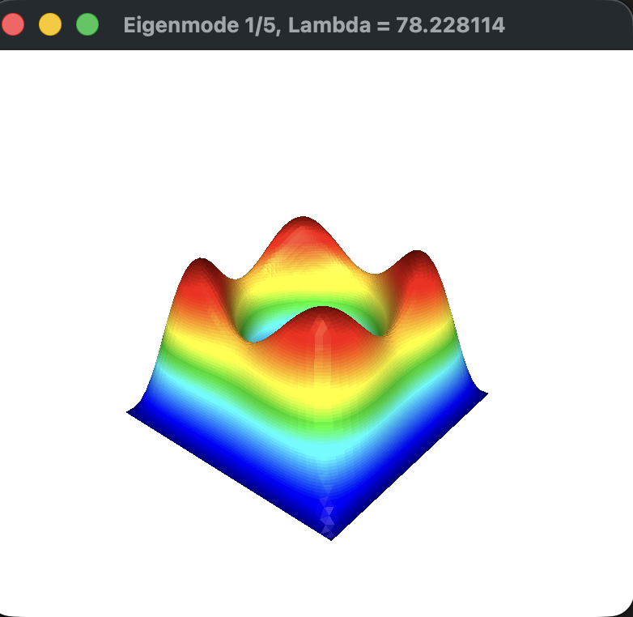
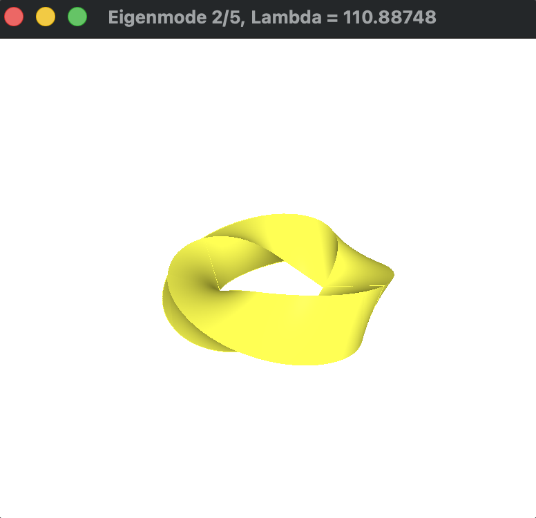

# 📘 Laplacian Eigenproblem

`[duration]` `[difficulty: basic | intermediate | advanced]`

> **✓ Lesson Objectives**
>
> - Understand the Finite Element Discretization of Laplacian Eigenvalue Problem
> - Learn How to Use the LOBPCG Eigensolver with the BoomerAMG preconditioner or a direct parallel solver to solve eigenvalue problems  


> **ℹ Note**
>
> Please complete the [Finite Element Basics](https://mfem.org/tutorial/fem/) lesson on `ex1.cpp` before this one. [Add any other prerequisite examples here, e.g., "We also recommend viewing Example N before this one."]

---

## ☑ Laplacian Eigenproblem

The Laplacian Eigenproblem (also known as the Laplacian Eigenfunction) is a partial differential equation (PDE) that finds both the solution $u$ and the eigenvalue $\lambda$ for the laplacian of $u$. It has applications in which it is necessary to analyze the spatial frequency inside of the bounded domain of general shape $\Omega\subset\mathbb{R}^d$. The PDE is given as

$$-\Delta u = \lambda u \quad \text{in } \Omega, \tag{1}$$

with homogenous dirichlet boundary conditions

$$u = 0 \quad \text{on } \partial\Omega.$$

Where $\Omega$ is a bounded domain of general shape $\Omega\subset\mathbb{R}^d$. 


### Weak form

To solve the PDE, we first derive the weak form. To do so, we multiply the PDE by a test function $v \in H^1_0(\Omega)$, which gives us 

$$(-\Delta u) v = \lambda (u) v\quad \text{in } \Omega, \qquad u = 0 \quad \text{on } \partial\Omega.$$

We then integrate both sides over $\Omega$:

$$\int_\Omega (-\Delta u) v \, dx = \lambda \int_\Omega u v \, dx.$$

Integrating by parts and using the divergence theorem on the left-hand side we arrive at:

$$\int_\Omega \nabla u \cdot \nabla v \, dx - \int_{\partial\Omega} (\nabla u \cdot n) \, v \, ds = \lambda \int_\Omega u \, v \, dx.$$

Since $v \in H^1_0(\Omega)$ vanishes on $\partial\Omega$, the boundary term drops out:

$$\int_\Omega \nabla u \cdot \nabla v \, dx = \lambda \int_\Omega u v \, dx.$$

Giving us the final weak form:

$$\begin{cases} 
    \text{Find } u \in H^1_0(\Omega) \text{ such that } u=0 \text{ on } \partial\Omega \text{ and}\\
    (\nabla u, \nabla v) = \lambda(u,v).
\end{cases} \tag{2}$$

### Galerkin Discretization

We use galerkin reduction to approximate the analytical solution $u$ as $u_h$, where 

$$u_h = \sum_{i = 1}^n c_i \varphi_i,$$

$c_i$ represents the coefficients, corresponding to the degrees of freedom. $\varphi_i$ represents the basis functions, which in this case are piecewise polynomial functions of the specified order. For our test function approximation of $v$, we can approximate $v$ as $v_h = \varphi_j$.
Substituting $u_h$ and $v_h$ for $u$ and $v$ respectively yields

$$\sum_{i=1}^n c_i \int_\Omega \nabla\varphi_i \cdot \nabla\varphi_j \, dx = \lambda \sum_{i=1}^n c_i \int_\Omega \varphi_i \, \varphi_j \, dx. \tag{3}$$

We can rewrite equation (3) as 

$$ A\textbf{x} = \lambda M\textbf{x}, \tag{4}$$

where

$$A_{ij} = \int_\Omega \nabla\varphi_i \cdot \nabla\varphi_j \, dx,$$

$$M_{ij} =  \int_\Omega \varphi_i \, \varphi_j \, dx,$$

$$\textbf{x}_i = c_i.$$

### [Optional subsection: anything specific to this example]

[E.g., "Why a generalized eigenvalue problem?", "Why an $H(\text{curl})$ space?", "Why DG?". One short subsection per non-obvious choice the example makes.]

> **ℹ Note**
>
> [Optional pointer to deeper theory or related MFEM docs. Keep it brief — one or two sentences.]

---

## ☑ Annotated Example 11

MFEM's Example 11 implements the above formulation in the source file [`examples/ex11p.cpp`](https://github.com/mfem/mfem/blob/master/examples/ex11p.cpp). [State whether the example has a serial version, a parallel version, or both, and which you're annotating.]

[One-paragraph summary of what the example does end-to-end: e.g., "We compute the lowest `nev` eigenpairs on a mesh provided as input."]

Below we highlight selected portions of the example code and connect them with the description in the previous section. You can follow along by browsing [`ex11p.cpp`](https://github.com/mfem/mfem/blob/master/examples/ex11p.cpp) in your editor.

The purpose of this example is to compute a set of the lowest eigenmodes for the referred eigenproblem. This example is only run in parallel.

### [Section 1 — typically MPI/HYPRE init for a parallel example]

[Initialize MPI and HYPRE.] ([lines 61–64](https://github.com/mfem/mfem/blob/master/examples/ex11p.cpp#L61-L64)):

To start, we first initialize MPI and Hypre.

```cpp
Mpi::Init(argc, argv);
   int num_procs = Mpi::WorldSize();
   int myid = Mpi::WorldRank();
   Hypre::Init();
```

[Prose explanation: what the code does, why it's here, anything subtle.]

### [Section 2 — Parse command-line options.]

The example accepts several command-line options to control mesh, polynomial order, number of eigenmodes, and solver choice:

[Parse command-line options.] ([lines 67–132](https://github.com/mfem/mfem/blob/master/examples/ex11p.cpp#L67-L132)):

```cpp
const char *mesh_file = "../data/star.mesh";
   int ser_ref_levels = 2;
   int par_ref_levels = 1;
   int order = 1;
   int nev = 5;
   int seed = 75;
   bool slu_solver  = false;
   bool sp_solver = false;
   bool cpardiso_solver = false;
   bool visualization = 1;
```

The above lines set the default parameters. To allow the user to change the parameters in the command line when running, we use `args.AddOption` on each of the parameters. `OptionsParser` allows us to parse the command line arguments.

[Explain what each option controls. Highlight the ones specific to this example.]

### [Section 3 — mesh construction]

The code loads the computational mesh from the file the user inputted, and then, creates the class `Mesh` and the corresponding object `mesh`. 


[Read the (serial) mesh from the given mesh file on all processors. We can handle triangular, quadrilateral, tetrahedral, hexahedral, surface and volume meshes with the same code.] ([lines 137–138](https://github.com/mfem/mfem/blob/master/examples/ex11p.cpp#L137-L138)):

```cpp
Mesh *mesh = new Mesh(mesh_file, 1, 1);
int dim = mesh->Dimension();
```

### [Section 4 — Refine the serial mesh]

[Refine the serial mesh on all processors to increase the resolution. In this example we do 'ref_levels' of uniform refinement (2 by default, or specified on the command line with -rs).] ([lines 143–146](https://github.com/mfem/mfem/blob/master/examples/ex11p.cpp#LX143-L146)):

The mesh is then refined uniformly on all processors. The number of refinement levels is $2$ by default but can be changed via user input.

```cpp
for (int lev = 0; lev < ser_ref_levels; lev++)
   {
      mesh->UniformRefinement();
   }
```

### [Section 5 — Define parallel mesh]

[Define a parallel mesh by a partitioning of the serial mesh. Refine this mesh further in parallel to increase the resolution (1 time by default, or specified on the command line with -rp). Once the parallel mesh is defined, the serial mesh can be deleted.] ([lines 152–157](https://github.com/mfem/mfem/blob/master/examples/ex11p.cpp#L152-L157)):

We now want to create a new parallel mesh. The next three lines create the parallel mesh by partitioning the serial mesh and refining further to increase the resolution. The additional refinement level, `par_ref_levels`, is set to $1$ by default but can be modified via user input.

```cpp
ParMesh *pmesh = new ParMesh(MPI_COMM_WORLD, *mesh);
delete mesh;
for (int lev = 0; lev < par_ref_levels; lev++)
{
    pmesh->UniformRefinement();
}
```
Once we create our parallel mesh we are free to delete the serial mesh.

### [Section 6 — Define parallel finite element space]

[Define a parallel finite element space on the parallel mesh. Here we use continuous Lagrange finite elements of the specified order. If order < 1, we instead use an isoparametric/isogeometric space.] ([lines 162–180](https://github.com/mfem/mfem/blob/master/examples/ex11p.cpp#L162-L180)):

We now construct a finite element space using piecewise polynomial basis functions of the order the user inputted. We use an isoparametric/isogeometric space if the order < 1.

We create `FiniteElementCollection` object `fec`. If we have not already set the `fec` previously, we set the space to be the $H^1$ space on the given domain and `order` corresponds to the polynomial degree. If the user does not input an order value, `order` is set to 1.

```cpp
FiniteElementCollection *fec;
if (order > 0)
{
    fec = new H1_FECollection(order, dim);
}
else if (pmesh->GetNodes())
{
    fec = pmesh->GetNodes()->OwnFEC();
}
else
{
    fec = new H1_FECollection(order = 1, dim);
}

[code excerpt]

```


We now define a parallel finite element space

```cpp

ParFiniteElementSpace *fespace = new ParFiniteElementSpace(pmesh, fec);
HYPRE_BigInt size = fespace->GlobalTrueVSize();
if (myid == 0)
{
    cout << "Number of unknowns: " << size << endl;
}
```

The number of unknowns corresponds to the size of the linear system, or in other words, the number of coefficients $c_i$ from equation

[Explain which FE space is being built (H1, H(curl), H(div), L2) and why it's the right space for this problem.]


### [Section 7 — Parallel bilinear forms]

[Set up the parallel bilinear forms a(.,.) and m(.,.) on the finite element space. The first corresponds to the Laplacian operator -Delta, while the second is a simple mass matrix needed on the right hand side of the generalized eigenvalue problem below. The boundary conditions are implemented by elimination with special values on the diagonal to shift the Dirichlet eigenvalues out of the computational range. After serial and parallel assembly we extract the corresponding parallel matrices A and M.] ([lines 190–241](https://github.com/mfem/mfem/blob/master/examples/ex11p.cpp#L190-L241)):

The array `ess_bdr` identifies the boundaries that are Dirichlet. The function `MarkExternalBoundaries` takes `ess_bdr` as an input and applies the boundary conditions to all external boundaries.

As mentioned previously the boundary conditions are homogenous Dirichlet. We apply homogeneous Dirichlet boundary conditions on $\partial \Omega$. `ess_br` stores the attributes of the boundary and flags the attributes corresponding to homogenous Dirichlet boundary conditions. `MarkExternalBoundaries` applies the boundary conditions on all external boundaries.

We set up the parallel bilinear forms on the finite element space for _ and _. This is created using the class `ParaBilinearForm`
```cpp
ParBilinearForm *a = new ParBilinearForm(fespace);
a->AddDomainIntegrator(new DiffusionIntegrator(one));
if (pmesh->bdr_attributes.Size() == 0)
{
   
    a->AddDomainIntegrator(new MassIntegrator(one));
}
a->Assemble();
a->EliminateEssentialBCDiag(ess_bdr, 1.0);
a->Finalize();
```

We find the stiffness matrix $A$ by using a diffusion integrator, `DiffusionIntegrator`, over the domain. We add a mass term if the mesh has no boundary.

We find the mass matrx $M$ by using the mass integrator `MassIntegrator`.

```cpp
ParBilinearForm *m = new ParBilinearForm(fespace);
m->AddDomainIntegrator(new MassIntegrator(one));
m->Assemble();
// shift the eigenvalue corresponding to eliminated dofs to a large value
m->EliminateEssentialBCDiag(ess_bdr, numeric_limits<real_t>::min());
m->Finalize();
```

The eigenvalues are shifted because.....(fill in this part!!!!)

```cpp
HypreParMatrix *A = a->ParallelAssemble();
HypreParMatrix *M = m->ParallelAssemble();
```

```cpp
ConstantCoefficient one(1.0);
Array<int> ess_bdr;
if (pmesh->bdr_attributes.Size())
{
    ess_bdr.SetSize(pmesh->bdr_attributes.Max());
    ess_bdr = 0;

    pmesh->MarkExternalBoundaries(ess_bdr);
 
}
```

[Explain how essential vs. natural BCs are handled. If there's anything tricky about the BC handling — e.g., elimination, weak imposition — explain it here.]


### [Section 8 — Setting up Eigensolver]

[Define and configure the LOBPCG eigensolver and the BoomerAMG preconditioner for A to be used within the solver. Set the matrices which define the generalized eigenproblem A x = lambda M x.] ([lines 246–302](https://github.com/mfem/mfem/blob/master/examples/ex11p.cpp#L246-L302)):

The example utilizes the LOBPCG eigenvalue solver to find the eigenmodes. By default, the example uses the LOBPCG solver with the BoomerAMG preconditioner in Hypre. However, the user can choose to use the eigenvalue solver with either the SuperLU, STRUMPACK, or CPardiso parallel direct solvers. The user can specify their choice of direct solver on the command line.

```cpp
Solver * precond = NULL;
if (!slu_solver && !sp_solver && !cpardiso_solver)
{
    HypreBoomerAMG * amg = new HypreBoomerAMG(*A);
    amg->SetPrintLevel(0);
    precond = amg;
}
else
{
#ifdef MFEM_USE_SUPERLU
    if (slu_solver)
    {
        SuperLUSolver * superlu = new SuperLUSolver(MPI_COMM_WORLD);
        superlu->SetPrintStatistics(false);
        superlu->SetSymmetricPattern(true);
        superlu->SetColumnPermutation(superlu::PARMETIS);
        superlu->SetOperator(*Arow);
        precond = superlu;
    }
#endif
#ifdef MFEM_USE_STRUMPACK
    if (sp_solver)
    {
        STRUMPACKSolver * strumpack = new STRUMPACKSolver(MPI_COMM_WORLD, argc, argv);
        strumpack->SetPrintFactorStatistics(true);
        strumpack->SetPrintSolveStatistics(false);
        strumpack->SetKrylovSolver(strumpack::KrylovSolver::DIRECT);
        strumpack->SetReorderingStrategy(strumpack::ReorderingStrategy::METIS);
        strumpack->SetMatching(strumpack::MatchingJob::NONE);
        strumpack->SetCompression(strumpack::CompressionType::NONE);
        strumpack->SetOperator(*Arow);
        strumpack->SetFromCommandLine();
        precond = strumpack;
    }
#endif
#ifdef MFEM_USE_MKL_CPARDISO
    if (cpardiso_solver)
    {
        auto cpardiso = new CPardisoSolver(A->GetComm());
        cpardiso->SetMatrixType(CPardisoSolver::MatType::REAL_STRUCTURE_SYMMETRIC);
        cpardiso->SetPrintLevel(1);
        cpardiso->SetOperator(*A);
        precond = cpardiso;
    }
#endif
}
 
```

In this problem, the parallel direct solvers can be used as a preconditioner for the eigensolver.

This step sets up the eigensolver, initialized as a `HypreLOBPCG` eigensolver. The number of eigenmodes is specified by nev. `SetTol` sets the convergence criteria while `SetMaxIter` sets the number of iterations to be 200. `SetMassMatrix` and `SetOperator` set the $M$ and $A$ matrices to define the eigenproblem.

```cpp
HypreLOBPCG * lobpcg = new HypreLOBPCG(MPI_COMM_WORLD);
lobpcg->SetNumModes(nev);
lobpcg->SetRandomSeed(seed);
lobpcg->SetPreconditioner(*precond);
lobpcg->SetMaxIter(200);
lobpcg->SetTol(1e-8);
lobpcg->SetPrecondUsageMode(1);
lobpcg->SetPrintLevel(1);
lobpcg->SetMassMatrix(*M);
lobpcg->SetOperator(*A);
```

[Explain the choice of solver and preconditioner. Why is this combination appropriate for this PDE? What's the expected scaling behavior?]

[Explain what `Solve()` / `Mult()` does, what the return value or output is, and how the solution is post-processed if needed.]

### [Section 9 — Compute eigenmodes and extract eigenvalues]

[Compute the eigenmodes and extract the array of eigenvalues. Define a parallel grid function to represent each of the eigenmodes returned by the solver.] ([lines 307–310](https://github.com/mfem/mfem/blob/master/examples/ex11p.cpp#L307-L310)):

```cpp
    Array<real_t> eigenvalues;
   lobpcg->Solve();
   lobpcg->GetEigenvalues(eigenvalues);
   ParGridFunction x(fespace);
```

`Solve` computes the eigenmodes and `GetEigenvalues` extracts the eigenvalues and stores them in the array `eigenvalues`. `ParGridFunction` applied on `fespace` defines a parallel grid function to represent each eigenmode that the solver returns.

[Explain how the solution is written to disk and/or sent to GLVis.]

[Add additional sections as needed — e.g., error computation against an exact solution, time-stepping loop, AMR loop. Use the same pattern: description → code excerpt → prose.]

### [Section 10 — Save refined mesh and modes in parallel]

[Save the refined mesh and the modes in parallel. This output can be viewed later using GLVis: "glvis -np <np> -m mesh -g mode".] ([lines 314–335](https://github.com/mfem/mfem/blob/master/examples/ex11p.cpp#L314-L335)):

Once the eigenmodes have been computed, we want to save the refined mesh and eigenmodes in parallel:

```cpp
    {
      ostringstream mesh_name, mode_name;
      mesh_name << "mesh." << setfill('0') << setw(6) << myid;
    
      ofstream mesh_ofs(mesh_name.str().c_str());
      mesh_ofs.precision(8);
      pmesh->Print(mesh_ofs);
    
      for (int i=0; i<nev; i++)
      {
         // convert eigenvector from HypreParVector to ParGridFunction
         x = lobpcg->GetEigenvector(i);
    
         mode_name << "mode_" << setfill('0') << setw(2) << i << "."
                   << setfill('0') << setw(6) << myid;
    
         ofstream mode_ofs(mode_name.str().c_str());
         mode_ofs.precision(8);
         x.Save(mode_ofs);
         mode_name.str("");
      }
    }
```

We convert each eigenvector from a HypreParVector to a ParaGridFunction.

### [Section 11 — Send solution to GLVis server]

[Send the solution by socket to a GLVis server.] ([lines 338–375](https://github.com/mfem/mfem/blob/master/examples/ex11p.cpp#L338-L375)):

```cpp
    if (visualization)
   {
      char vishost[] = "localhost";
      int  visport   = 19916;
      socketstream mode_sock(vishost, visport);
      mode_sock.precision(8);

      for (int i=0; i<nev; i++)
      {
         if ( myid == 0 )
         {
            cout << "Eigenmode " << i+1 << '/' << nev
                 << ", Lambda = " << eigenvalues[i] << endl;
         }

         // convert eigenvector from HypreParVector to ParGridFunction
         x = lobpcg->GetEigenvector(i);

         mode_sock << "parallel " << num_procs << " " << myid << "\n"
                   << "solution\n" << *pmesh << x << flush
                   << "window_title 'Eigenmode " << i+1 << '/' << nev
                   << ", Lambda = " << eigenvalues[i] << "'" << endl;

         char c;
         if (myid == 0)
         {
            cout << "press (q)uit or (c)ontinue --> " << flush;
            cin >> c;
         }
         MPI_Bcast(&c, 1, MPI_CHAR, 0, MPI_COMM_WORLD);

         if (c != 'c')
         {
            break;
         }
      }
      mode_sock.close();
   }
```

prints a status line
We extract each eigenvector and send the eigenmode and mesh to GLVIS by writing it to the socket. On GLVIS, the user inputs 'c' to continue to display the next eigenmode on GLVIS

### [Section 12 — Free used memory]

To conclude the example, we free all used memory, including the memory taken by the eigensolver, preconditione/parallel direct solver, our $A$ and $M$ matrices, the mesh, and the finite element space ([lines 378–394](https://github.com/mfem/mfem/blob/master/examples/ex11p.cpp#L338-L375)):

---

```cpp
    delete lobpcg;
   delete precond;
   delete M;
   delete A;
#if defined(MFEM_USE_SUPERLU) || defined(MFEM_USE_STRUMPACK)
   delete Arow;
#endif

   delete fespace;
   if (order > 0)
   {
      delete fec;
   }
   delete pmesh;

   return 0;
}
```

## ☑ Sample runs

A few representative invocations (these match the comments at the top of `ex11p.cpp`):

```bash
mpirun -np 4 ex11p -m ../data/square-disc.mesh


mpirun -np 4 ex11p -m ../data/[mesh2].mesh -o 2


mpirun -np 4 ex11p -m ../data/star.mesh -slu
mpirun -np 4 ex11p -m ../data/star.mesh -sp
mpirun -np 4 ex11p -m ../data/star.mesh -cpardiso

```

The first run line solves eigenvalue problem on the square disk mesh. 

The resulting GLVIS plot corresponds to the first eigenfunction, which is the lowest eigenmode.


The second run solves the eigenvalue problem on the toroid-wedge mesh. This time, the polynomial order is specified by user input to be 2. 

The resulting GLVIS plot corresponds to the second eigenfunction for the torus-wedge.


The last three runs describe how the user can specify a direct parallel solver to be used as a substitute for the BoomerAMG preconditioner.

[Brief description of what each sample run is testing — different mesh types, different orders, different physics regimes.]

> **ℹ Try this!**
>
> [Concrete experiment 1 — usually about convergence or basic behavior. Include expected output or a property the reader can check.]
>
> ```
> [expected output snippet, if useful]
> ```

> **ℹ Try this!**
>
> [Concrete experiment 2 — usually exploring a parameter (polynomial order, mesh refinement, problem variant). State what theoretical prediction the reader should verify.]

> **⚠ Warning**
>
> [Optional warning about a common pitfall — e.g., "Don't forget the `./` before the executable on macOS", or "This example requires GLVis to be running on port 19916 to see visualizations".]

---

---

MFEM puts constants in the diagonals - extremely small number

- this is for eliminating dirichlet bcs
don't want dirichlet eigenvalues to be big
we want lowest eigenvalues

## ☑ [Optional: special section unique to this example]

[Use this slot for content that doesn't fit elsewhere. Examples:]

- **Why parallel-only?** — if the example has no serial version, explain why.
- **Convergence study** — if the example is well-suited to a discretization-error study.
- **Parallel scaling notes** — if the example demonstrates a performance feature.
- **Comparison to another example** — e.g., "Compared to ex1, this example differs in...".

[Delete this section if not needed.]

---

## ☑ Things to keep in mind

- **[Key takeaway 1 — usually the most important conceptual point].** [One- or two-sentence elaboration.]

- **[Key takeaway 2].** [Elaboration.]

- **[Key takeaway 3].** [Elaboration.]

- **[Add 1–2 more bullets if needed.]**

---

## ☑ Next Steps

- [Example M](https://mfem.org/examples/#exM): [One-line description of why a reader of this annotation might want to look at it next.]
- [Example K](https://mfem.org/examples/#exK): [Description.]
- [Optional: link to a miniapp or tutorial page for further reading.]

[Back to the MFEM tutorial page](https://mfem.org/tutorial/)

---

*Based on `ex11p.cpp` from MFEM master branch. Line numbers refer to the master version on GitHub at the time of writing and may shift slightly in other releases.*

*Annotated by Siddhant Ranka and Luis Gomez, APMA 2560, 08 May 2026.*
